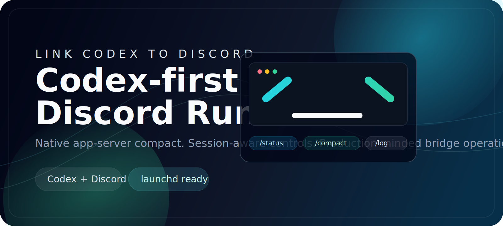
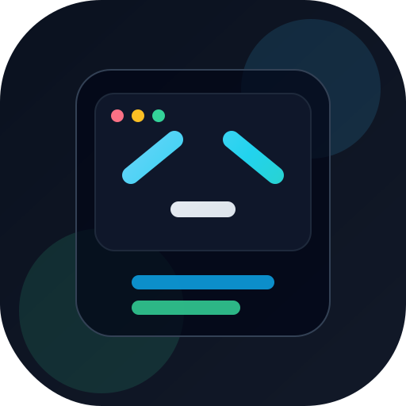

<p align="center">
  
</p>

<p align="center">
  
</p>

<h1 align="center">Link Codex To Discord</h1>

<p align="center">
  Deployable Discord runtime for <code>Codex</code> and <code>Claude Code</code>, with native session controls, compact support, and production-minded daemon tooling.
</p>

<p align="center">
  <a href="https://github.com/kkellyoffical/link-codex-to-discord/releases/tag/v1.2.0"></a>
  <a href="./LICENSE"></a>
  
  
</p>

## Language Navigation

| Language | Document |
| --- | --- |
| English | [README/README.en.md](./README/README.en.md) |
| 简体中文 | [README/README.zh-Hans.md](./README/README.zh-Hans.md) |
| Français | [README/README.fr.md](./README/README.fr.md) |
| Русский | [README/README.ru.md](./README/README.ru.md) |
| 조선말 | [README/README.ko.md](./README/README.ko.md) |

## Why This Project

This repository packages a Codex-first Discord bridge into a deployable runtime:

- Native `Codex` and `Claude Code` bridging
- Native app-server `/compact` flow instead of tmux injection on the main path
- Session-aware controls like `/status`, `/permissions`, `/log`, `/resume`, and `/cwd`
- Launchd and supervisor tooling for long-running local deployments

## Project Map

| Area | What It Contains |
| --- | --- |
| [`dist/`](./dist) | Deployable bundled runtime |
| [`scripts/`](./scripts) | Daemon management, diagnostics, supervisors |
| [`docs/DEPLOYMENT.md`](./docs/DEPLOYMENT.md) | End-to-end deployment steps |
| [`docs/AI_AGENT_DEPLOYMENT.md`](./docs/AI_AGENT_DEPLOYMENT.md) | Deterministic agent deployment runbook |
| [`docs/ARCHITECTURE.md`](./docs/ARCHITECTURE.md) | Runtime behavior and data flow |
| [`docs/RELEASE.md`](./docs/RELEASE.md) | Release workflow |
| [`docs/ROADMAP.md`](./docs/ROADMAP.md) | Roadmap |
| [`config.env.example`](./config.env.example) | Runtime configuration template |

## Quick Start

```bash
npm install
mkdir -p ~/.link-codex-to-discord
cp config.env.example ~/.link-codex-to-discord/config.env
bash scripts/doctor.sh
bash scripts/daemon.sh start
```

Then edit `~/.link-codex-to-discord/config.env` with your Discord token, allowlists, runtime, and default working directory.

## Quick Links

- Deployment: [docs/DEPLOYMENT.md](./docs/DEPLOYMENT.md)
- AI agent deployment: [docs/AI_AGENT_DEPLOYMENT.md](./docs/AI_AGENT_DEPLOYMENT.md)
- Architecture: [docs/ARCHITECTURE.md](./docs/ARCHITECTURE.md)
- Release workflow: [docs/RELEASE.md](./docs/RELEASE.md)
- Roadmap: [docs/ROADMAP.md](./docs/ROADMAP.md)
- Changelog: [CHANGELOG.md](./CHANGELOG.md)
- Security: [SECURITY.md](./SECURITY.md)

## Acknowledgements

- [`op7418/claude-to-im`](https://github.com/op7418/claude-to-im) for the original IM bridge foundation and operating model
- [OpenAI Codex CLI / Codex SDK](https://github.com/openai/codex) for the Codex runtime and app-server interfaces
- [discord.js](https://discord.js.org/) and the Discord platform for the bot integration layer

`link-codex-to-discord` now evolves as its own Codex-first Discord runtime.
